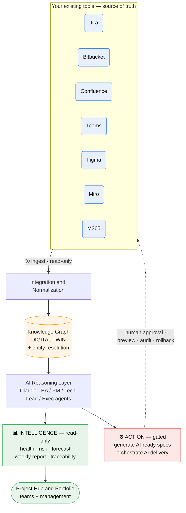
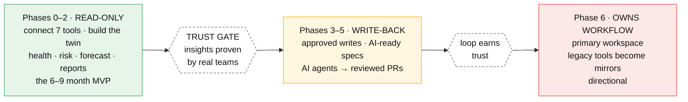

# The Idea, in Two Diagrams

> Visual companions to the [Executive Summary](./EXECUTIVE-SUMMARY.md) and [Overview](./00-overview.md). Both render natively on GitHub and in most IDE markdown previews.

---

## 1. How it works — tools → digital twin → value

The platform ingests your existing tools (read-only), normalizes them into a **knowledge graph / digital twin**, and reasons over it with AI to produce **intelligence** (read-only) and, when trusted, **action** (gated). Every write back to a tool passes through human approval, preview, audit, and rollback — that is the dotted return arrow.

---

## 2. How it rolls out — the strangler-fig adoption journey

We never big-bang. The platform starts as a low-risk read-only layer *over* the tools, and only takes on more of the workflow after each step earns trust. The first **trust gate** — after the read-only MVP — is the formal go/no-go before any write-back is enabled.

---

*Colour key: blue = your tools · amber = the digital twin · green = read-only value · yellow = gated write-back · red = workflow ownership.*
